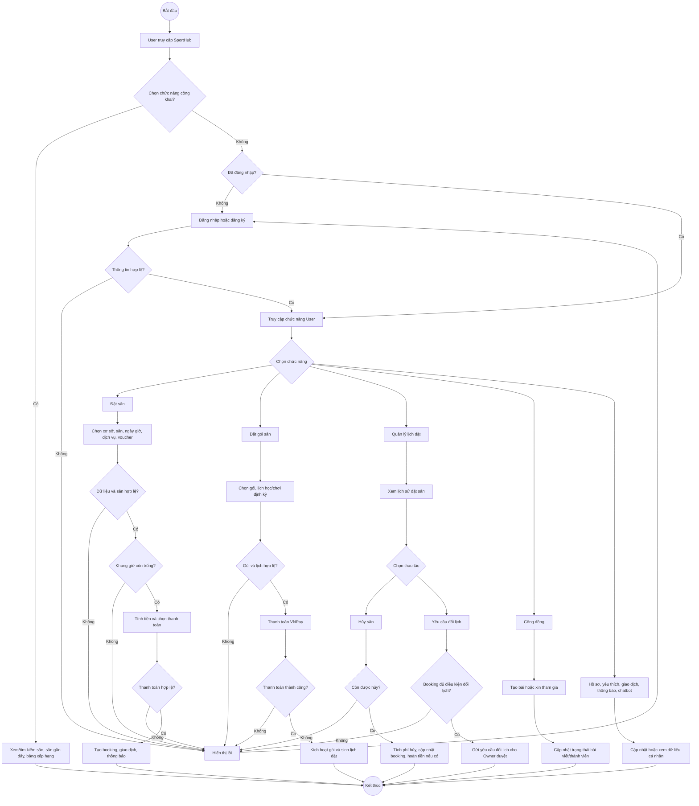
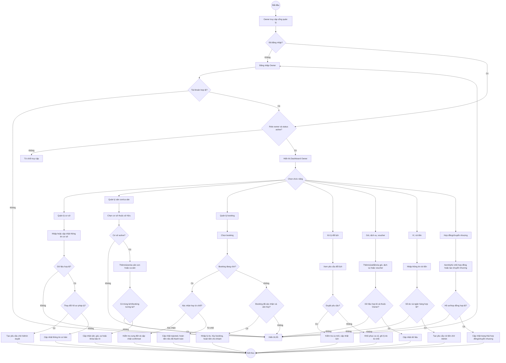
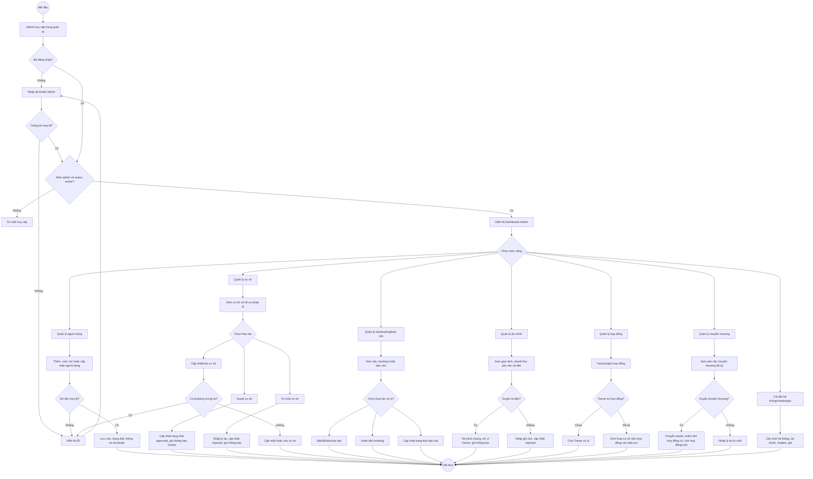

# 3.7. Sơ đồ hoạt động theo phân quyền

Dự án SportHub sử dụng ba phân quyền chính: **User**, **Owner** và **Admin**. Mỗi phân quyền được hệ thống kiểm tra khi người dùng truy cập chức năng tương ứng. Nếu người dùng chưa đăng nhập, sai vai trò hoặc tài khoản không ở trạng thái hoạt động, hệ thống sẽ từ chối truy cập hoặc chuyển về trang đăng nhập.

## 3.7.1. Phân quyền User

### 3.7.1.1. Chức năng của User

User là khách hàng sử dụng hệ thống để tìm kiếm, đặt sân và quản lý lịch đặt của mình.

Các chức năng chính:

- Đăng ký, đăng nhập, đăng xuất.
- Xem danh sách sân, tìm kiếm sân, xem cơ sở gần đây và bảng xếp hạng.
- Xem chi tiết cơ sở, sân con, khung giờ trống và voucher áp dụng.
- Đặt sân lẻ, đặt gói sân, thanh toán bằng COD, ví hoặc VNPay tùy luồng.
- Xem lịch sử đặt sân, hủy sân, yêu cầu đổi lịch.
- Xem lịch sử giao dịch, nhận thông báo.
- Đánh giá sân sau khi sử dụng, báo cáo sân vi phạm.
- Thêm hoặc bỏ yêu thích cơ sở sân.
- Tham gia cộng đồng tìm người chơi cùng.
- Cập nhật hồ sơ cá nhân, mật khẩu, ảnh đại diện, thông tin ngân hàng.
- Sử dụng chatbot hỗ trợ.

### 3.7.1.2. Các bước hoạt động tổng quát của User

1. User truy cập hệ thống SportHub.
2. Hệ thống hiển thị trang tìm sân, sân gần đây, bảng xếp hạng và chi tiết cơ sở.
3. Nếu User chỉ xem thông tin công khai thì không bắt buộc đăng nhập.
4. Nếu User thực hiện chức năng cá nhân như đặt sân, đặt gói, hủy lịch, đổi lịch, yêu thích, đánh giá hoặc cộng đồng, hệ thống yêu cầu đăng nhập.
5. User nhập thông tin đăng nhập hoặc đăng ký tài khoản.
6. Hệ thống kiểm tra thông tin tài khoản.
7. Nếu thông tin không hợp lệ, hệ thống hiển thị lỗi.
8. Nếu hợp lệ, hệ thống cho phép User chọn chức năng.
9. Với chức năng đặt sân:
   - User chọn cơ sở, sân con, ngày, giờ, dịch vụ đi kèm và voucher nếu có.
   - Hệ thống kiểm tra cơ sở/sân có hoạt động không.
   - Hệ thống kiểm tra khung giờ có còn trống không.
   - Nếu dữ liệu không hợp lệ hoặc khung giờ đã có người đặt, hệ thống hiển thị lỗi.
   - Nếu hợp lệ, hệ thống tính tiền, áp dụng voucher và kiểm tra phương thức thanh toán.
   - Nếu thanh toán bằng ví nhưng số dư không đủ, hệ thống hiển thị lỗi.
   - Nếu thanh toán hợp lệ, hệ thống tạo booking, tạo giao dịch và gửi thông báo.
10. Với chức năng quản lý lịch đặt:
    - User xem lịch sử booking.
    - User có thể hủy booking nếu chưa đến giờ chơi.
    - Hệ thống tính phí hủy theo chính sách của cơ sở và hoàn tiền vào ví nếu đủ điều kiện.
    - User có thể gửi yêu cầu đổi lịch nếu booking đã được xác nhận và còn trước giờ chơi tối thiểu theo quy định.
11. Với chức năng cộng đồng:
    - User tạo bài tìm người chơi, xin tham gia bài viết, duyệt hoặc từ chối người xin tham gia bài viết do mình tạo.
12. Hệ thống cập nhật dữ liệu, hiển thị thông báo thành công hoặc lỗi.
13. Kết thúc luồng.

### 3.7.1.3. Mã Mermaid sơ đồ hoạt động User

## 3.7.2. Phân quyền Owner

### 3.7.2.1. Chức năng của Owner

Owner là chủ sân/đối tác quản lý cơ sở sân của mình. Tài khoản Owner phải có vai trò `owner` và trạng thái `active` mới được truy cập khu vực quản lý.

Các chức năng chính:

- Đăng ký làm chủ sân, thiết lập mật khẩu và đăng nhập cổng Owner.
- Xem dashboard tổng quan.
- Quản lý cơ sở sân: thêm cơ sở, xem danh sách, xem chi tiết, sửa thông tin, gửi hồ sơ pháp lý, tạm ngưng hoặc mở lại cơ sở.
- Quản lý sân con: thêm, sửa, xóa, bật/tắt trạng thái.
- Quản lý khung giờ: sinh ca tự động, thêm ca thủ công, cấu hình giá, khóa/mở khóa ca bảo trì.
- Quản lý lịch đặt sân: xem lịch, lọc theo cơ sở/sân/trạng thái, xác nhận hoặc từ chối booking, hủy booking đã xác nhận.
- Xử lý yêu cầu đổi lịch của khách hàng: duyệt hoặc từ chối.
- Quản lý gói đặt sân: bật/tắt đặt gói cho cơ sở, thêm/sửa/xóa/tắt gói.
- Quản lý dịch vụ đi kèm: thêm, sửa, bật/tắt, xóa dịch vụ nếu chưa phát sinh booking.
- Quản lý voucher: tạo, sửa, gia hạn, bật/tắt, xóa, xem báo cáo hiệu quả.
- Quản lý đánh giá: xem đánh giá và phản hồi khách hàng.
- Quản lý ví: xem số dư, nạp tiền, cập nhật ngân hàng, tạo yêu cầu rút tiền.
- Quản lý hợp đồng hợp tác với Admin: xem, tải, ký hoặc từ chối hợp đồng.
- Chuyển nhượng cơ sở cho Owner khác.
- Nhận và đọc thông báo.

### 3.7.2.2. Các bước hoạt động tổng quát của Owner

1. Owner truy cập khu vực quản lý chủ sân.
2. Hệ thống kiểm tra đăng nhập.
3. Hệ thống kiểm tra tài khoản có vai trò Owner và trạng thái active.
4. Nếu không hợp lệ, hệ thống từ chối truy cập hoặc hiển thị lỗi.
5. Nếu hợp lệ, hệ thống hiển thị dashboard Owner.
6. Owner chọn nhóm chức năng cần thao tác.
7. Với chức năng quản lý cơ sở:
   - Owner nhập thông tin cơ sở, địa chỉ, môn thể thao, hình ảnh, hồ sơ pháp lý.
   - Hệ thống kiểm tra dữ liệu.
   - Nếu hợp lệ, hệ thống tạo cơ sở ở trạng thái pending và gửi thông báo cho Admin.
   - Admin duyệt hồ sơ, sau đó cơ sở ở trạng thái approved.
   - Admin gửi hợp đồng; Owner ký hợp đồng.
   - Nếu hợp đồng có hiệu lực, cơ sở chuyển sang active để khách hàng đặt sân.
8. Với chức năng quản lý sân con và ca sân:
   - Owner chọn cơ sở thuộc quyền sở hữu.
   - Hệ thống kiểm tra quyền sở hữu và trạng thái cơ sở.
   - Owner thêm/sửa/xóa sân con hoặc sinh ca/thêm ca.
   - Hệ thống kiểm tra trùng ca và booking tương lai.
   - Nếu hợp lệ, hệ thống cập nhật dữ liệu; nếu không hợp lệ, hệ thống hiển thị lỗi.
9. Với chức năng quản lý lịch đặt:
   - Owner xem danh sách booking trên lịch.
   - Owner chọn booking đang chờ.
   - Owner xác nhận hoặc từ chối booking.
   - Nếu xác nhận, hệ thống kiểm tra xung đột lịch rồi cập nhật trạng thái confirmed.
   - Nếu từ chối booking đã thanh toán, hệ thống hoàn tiền cho khách.
   - Owner có thể hủy booking đã xác nhận và hoàn tiền 100% cho khách nếu có thanh toán.
10. Với chức năng đổi lịch:
    - Owner xem yêu cầu đổi lịch từ User.
    - Nếu duyệt, hệ thống kiểm tra ca mới, cập nhật booking và hoàn/thu chênh lệch nếu có.
    - Nếu từ chối, hệ thống khôi phục ca cũ và hoàn tiền chênh lệch nếu khách đã trả.
11. Với chức năng ví/rút tiền:
    - Owner xem ví, cập nhật ngân hàng, nhập số tiền rút.
    - Hệ thống kiểm tra số dư và thông tin ngân hàng.
    - Nếu hợp lệ, hệ thống tạo yêu cầu rút tiền chờ Admin xử lý.
12. Hệ thống lưu thay đổi, ghi lịch sử và gửi thông báo.
13. Kết thúc luồng.

### 3.7.2.3. Mã Mermaid sơ đồ hoạt động Owner

## 3.7.3. Phân quyền Admin

### 3.7.3.1. Chức năng của Admin

Admin là quản trị viên hệ thống, có quyền quản lý toàn bộ nền tảng. Tài khoản Admin phải có vai trò `admin` và trạng thái `active`.

Các chức năng chính:

- Đăng nhập/đăng xuất khu vực Admin.
- Xem dashboard tổng quan hệ thống.
- Quản lý người dùng: xem danh sách, lọc theo vai trò, thêm tài khoản, xem chi tiết, cập nhật thông tin, vai trò và trạng thái.
- Quản lý cơ sở sân: xem danh sách, lọc/tìm kiếm, cập nhật trạng thái, duyệt/từ chối cơ sở, xem hồ sơ pháp lý, xóa cơ sở nếu không có booking tương lai.
- Duyệt hoặc từ chối yêu cầu cập nhật hồ sơ pháp lý của Owner.
- Quản lý sân con: xem danh sách, xem chi tiết, bật/tắt trạng thái, sửa, xóa, cập nhật hàng loạt.
- Quản lý booking: xem danh sách booking, hoàn tiền.
- Quản lý báo cáo vi phạm: xem báo cáo và cập nhật trạng thái xử lý.
- Quản lý gói đặt sân toàn hệ thống.
- Quản lý chatbot logs.
- Quản lý giao dịch và chi tiết giao dịch.
- Quản lý tài chính: xem doanh thu, hoa hồng, ví nền tảng, rút doanh thu.
- Quản lý yêu cầu rút tiền của Owner: duyệt, từ chối, tải minh chứng chuyển khoản.
- Cấu hình tài chính, cấu hình hệ thống.
- Quản lý hợp đồng: tạo, sửa, gửi, xuất PDF, chấm dứt hợp đồng.
- Quản lý chuyển nhượng cơ sở: xem, duyệt, từ chối, tạo hợp đồng mới cho chủ sân mới sau chuyển nhượng.
- Nhận và đọc thông báo hệ thống.

### 3.7.3.2. Các bước hoạt động tổng quát của Admin

1. Admin truy cập trang quản trị.
2. Hệ thống kiểm tra đăng nhập.
3. Nếu chưa đăng nhập, hệ thống chuyển đến trang đăng nhập Admin.
4. Admin nhập thông tin đăng nhập.
5. Hệ thống kiểm tra tài khoản có vai trò Admin và trạng thái active.
6. Nếu không hợp lệ, hệ thống từ chối truy cập.
7. Nếu hợp lệ, hệ thống hiển thị dashboard Admin.
8. Admin chọn chức năng quản trị cần xử lý.
9. Với quản lý người dùng:
   - Admin xem, tìm kiếm, lọc danh sách người dùng.
   - Admin thêm mới hoặc cập nhật tài khoản.
   - Hệ thống kiểm tra email, mật khẩu, vai trò và trạng thái.
   - Nếu hợp lệ, hệ thống lưu dữ liệu; nếu không, hiển thị lỗi.
10. Với quản lý cơ sở:
    - Admin xem danh sách cơ sở đang chờ duyệt hoặc đang hoạt động.
    - Admin xem hồ sơ pháp lý.
    - Nếu hồ sơ hợp lệ, Admin duyệt cơ sở và hệ thống chuyển trạng thái sang approved.
    - Nếu hồ sơ không hợp lệ, Admin nhập lý do từ chối và hệ thống chuyển trạng thái sang rejected.
    - Với cơ sở đã có lịch đặt tương lai, hệ thống không cho xóa hoặc chấm dứt ảnh hưởng đến khách hàng.
11. Với quản lý hợp đồng:
    - Admin tạo hợp đồng cho Owner và cơ sở đã duyệt.
    - Admin gửi hợp đồng cho Owner ký.
    - Nếu Owner ký và hợp đồng còn hiệu lực, hệ thống kích hoạt cơ sở sang active.
    - Admin có thể xuất PDF hoặc chấm dứt hợp đồng nếu đủ điều kiện.
12. Với quản lý booking và báo cáo:
    - Admin xem danh sách booking hoặc báo cáo vi phạm.
    - Admin xử lý hoàn tiền hoặc cập nhật trạng thái báo cáo.
13. Với quản lý tài chính:
    - Admin xem giao dịch, doanh thu, công nợ và yêu cầu rút tiền.
    - Nếu duyệt rút tiền, Admin tải minh chứng, hệ thống ghi nhận giao dịch trừ ví Owner và gửi thông báo.
    - Nếu từ chối, Admin nhập ghi chú và hệ thống cập nhật trạng thái rejected.
14. Với chuyển nhượng cơ sở:
    - Admin xem hợp đồng chuyển nhượng đã được bên nhận ký.
    - Nếu duyệt, hệ thống chuyển owner của cơ sở, chấm dứt hợp đồng cũ và đưa cơ sở về trạng thái approved chờ hợp đồng mới.
    - Nếu từ chối, hệ thống ghi lý do và thông báo cho Owner.
15. Hệ thống lưu thay đổi, cập nhật trạng thái và gửi thông báo.
16. Kết thúc luồng.

### 3.7.3.3. Mã Mermaid sơ đồ hoạt động Admin

## Gợi ý trình bày trong báo cáo

- Với mỗi sơ đồ, nút bắt đầu và kết thúc dùng hình tròn.
- Các bước xử lý như "Đăng nhập", "Chọn chức năng", "Cập nhật dữ liệu" dùng hình chữ nhật.
- Các bước kiểm tra như "Dữ liệu hợp lệ?", "Role đúng?", "Có booking tương lai?" dùng hình thoi.
- Nhánh đúng ghi "True/Có", nhánh sai ghi "False/Không" giống mẫu trong ảnh.
- Sau bước thành công hoặc lỗi, mũi tên đưa về kết thúc hoặc quay lại form nhập liệu tùy nghiệp vụ.
