# 3.7. Sơ đồ hoạt động chi tiết theo phân quyền

Dự án SportHub chia người dùng thành ba phân quyền chính: **User**, **Owner** và **Admin**. Mỗi phân quyền có nhóm chức năng riêng, được kiểm soát thông qua tài khoản đăng nhập, vai trò (`role`) và trạng thái tài khoản (`status`).

Tài liệu này trình bày sơ đồ hoạt động chi tiết theo từng chức năng nhỏ để có thể đưa vào báo cáo giống cấu trúc mục lục mẫu: mỗi mục `3.7.x.x` tương ứng một sơ đồ hoạt động riêng.

## 3.7.1. Người dùng

### 3.7.1.1. Đăng ký tài khoản

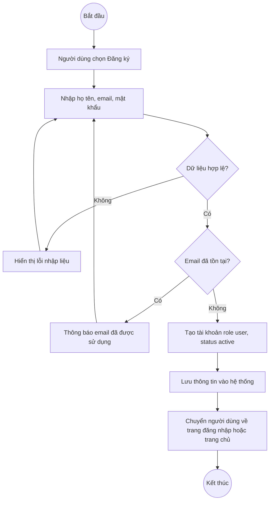
```mermaid
flowchart TD
    A((Bắt đầu)) --> B[Người dùng chọn Đăng ký]
    B --> C[Nhập họ tên, email, mật khẩu]
    C --> D{Dữ liệu hợp lệ?}
    D -- Không --> E[Hiển thị lỗi nhập liệu]
    E --> C
    D -- Có --> F{Email đã tồn tại?}
    F -- Có --> G[Thông báo email đã được sử dụng]
    G --> C
    F -- Không --> H[Tạo tài khoản role user, status active]
    H --> I[Lưu thông tin vào hệ thống]
    I --> J[Chuyển người dùng về trang đăng nhập hoặc trang chủ]
    J --> K((Kết thúc))
```

### 3.7.1.2. Đăng nhập và đăng xuất

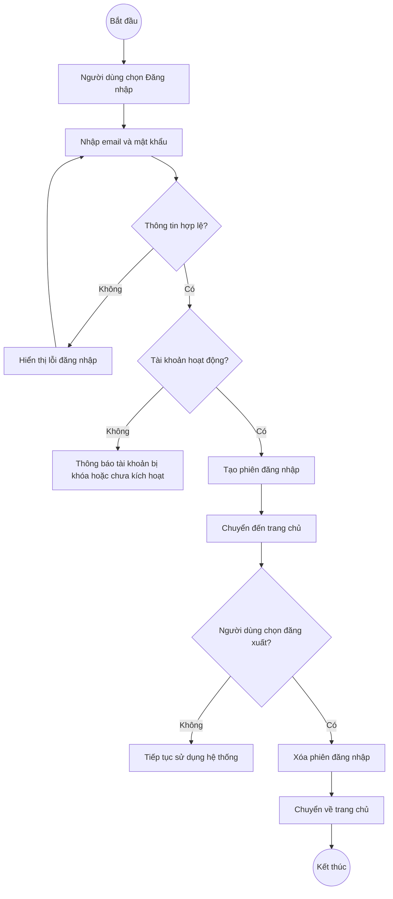
```mermaid
flowchart TD
    A((Bắt đầu)) --> B[Người dùng chọn Đăng nhập]
    B --> C[Nhập email và mật khẩu]
    C --> D{Thông tin hợp lệ?}
    D -- Không --> E[Hiển thị lỗi đăng nhập]
    E --> C
    D -- Có --> F{Tài khoản hoạt động?}
    F -- Không --> G[Thông báo tài khoản bị khóa hoặc chưa kích hoạt]
    F -- Có --> H[Tạo phiên đăng nhập]
    H --> I[Chuyển đến trang chủ]
    I --> J{Người dùng chọn đăng xuất?}
    J -- Không --> K[Tiếp tục sử dụng hệ thống]
    J -- Có --> L[Xóa phiên đăng nhập]
    L --> M[Chuyển về trang chủ]
    M --> N((Kết thúc))
```

### 3.7.1.3. Tìm kiếm và xem chi tiết sân

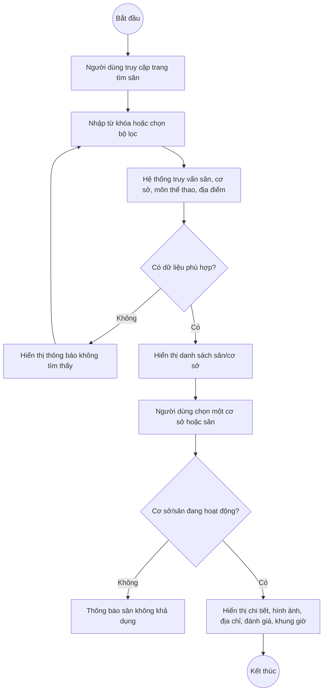
```mermaid
flowchart TD
    A((Bắt đầu)) --> B[Người dùng truy cập trang tìm sân]
    B --> C[Nhập từ khóa hoặc chọn bộ lọc]
    C --> D[Hệ thống truy vấn sân, cơ sở, môn thể thao, địa điểm]
    D --> E{Có dữ liệu phù hợp?}
    E -- Không --> F[Hiển thị thông báo không tìm thấy]
    F --> C
    E -- Có --> G[Hiển thị danh sách sân/cơ sở]
    G --> H[Người dùng chọn một cơ sở hoặc sân]
    H --> I{Cơ sở/sân đang hoạt động?}
    I -- Không --> J[Thông báo sân không khả dụng]
    I -- Có --> K[Hiển thị chi tiết, hình ảnh, địa chỉ, đánh giá, khung giờ]
    K --> L((Kết thúc))
```

### 3.7.1.4. Đặt sân lẻ

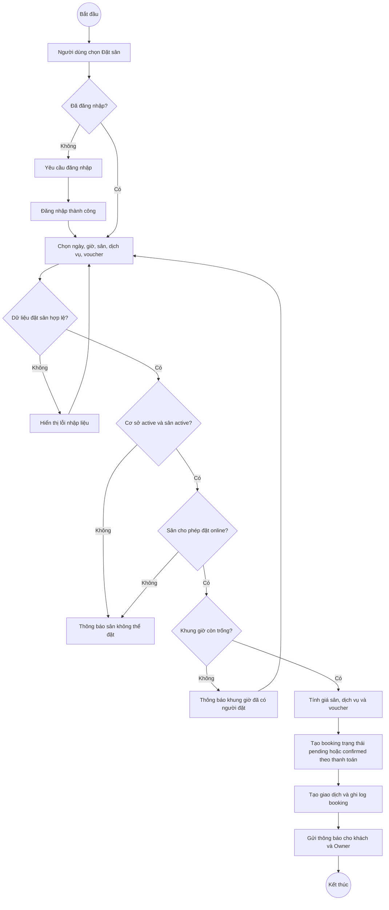
```mermaid
flowchart TD
    A((Bắt đầu)) --> B[Người dùng chọn Đặt sân]
    B --> C{Đã đăng nhập?}
    C -- Không --> D[Yêu cầu đăng nhập]
    D --> E[Đăng nhập thành công]
    E --> F[Chọn ngày, giờ, sân, dịch vụ, voucher]
    C -- Có --> F
    F --> G{Dữ liệu đặt sân hợp lệ?}
    G -- Không --> H[Hiển thị lỗi nhập liệu]
    H --> F
    G -- Có --> I{Cơ sở active và sân active?}
    I -- Không --> J[Thông báo sân không thể đặt]
    I -- Có --> K{Sân cho phép đặt online?}
    K -- Không --> J
    K -- Có --> L{Khung giờ còn trống?}
    L -- Không --> M[Thông báo khung giờ đã có người đặt]
    M --> F
    L -- Có --> N[Tính giá sân, dịch vụ và voucher]
    N --> O[Tạo booking trạng thái pending hoặc confirmed theo thanh toán]
    O --> P[Tạo giao dịch và ghi log booking]
    P --> Q[Gửi thông báo cho khách và Owner]
    Q --> R((Kết thúc))
```

### 3.7.1.5. Thanh toán đặt sân

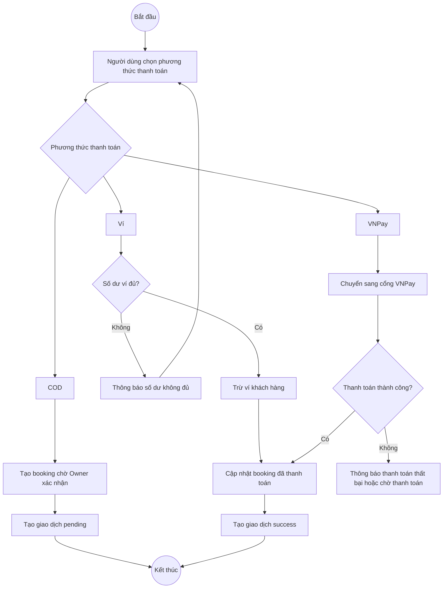
```mermaid
flowchart TD
    A((Bắt đầu)) --> B[Người dùng chọn phương thức thanh toán]
    B --> C{Phương thức thanh toán}
    C --> D[COD]
    C --> E[Ví]
    C --> F[VNPay]
    D --> G[Tạo booking chờ Owner xác nhận]
    E --> H{Số dư ví đủ?}
    H -- Không --> I[Thông báo số dư không đủ]
    I --> B
    H -- Có --> J[Trừ ví khách hàng]
    J --> K[Cập nhật booking đã thanh toán]
    F --> L[Chuyển sang cổng VNPay]
    L --> M{Thanh toán thành công?}
    M -- Không --> N[Thông báo thanh toán thất bại hoặc chờ thanh toán]
    M -- Có --> K
    G --> O[Tạo giao dịch pending]
    K --> P[Tạo giao dịch success]
    O --> Q((Kết thúc))
    P --> Q
```

### 3.7.1.6. Quản lý lịch sử đặt sân và hủy sân

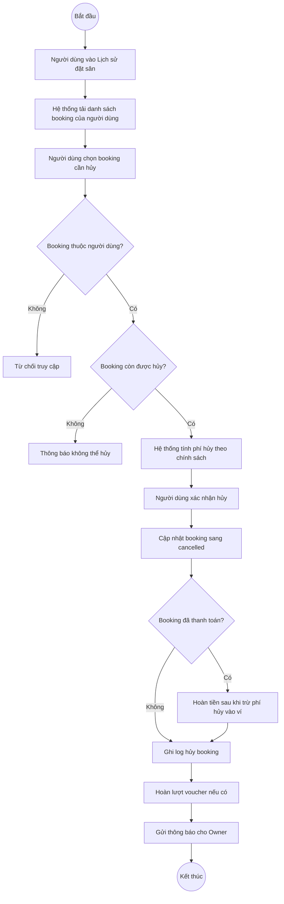
```mermaid
flowchart TD
    A((Bắt đầu)) --> B[Người dùng vào Lịch sử đặt sân]
    B --> C[Hệ thống tải danh sách booking của người dùng]
    C --> D[Người dùng chọn booking cần hủy]
    D --> E{Booking thuộc người dùng?}
    E -- Không --> F[Từ chối truy cập]
    E -- Có --> G{Booking còn được hủy?}
    G -- Không --> H[Thông báo không thể hủy]
    G -- Có --> I[Hệ thống tính phí hủy theo chính sách]
    I --> J[Người dùng xác nhận hủy]
    J --> K[Cập nhật booking sang cancelled]
    K --> L{Booking đã thanh toán?}
    L -- Không --> M[Ghi log hủy booking]
    L -- Có --> N[Hoàn tiền sau khi trừ phí hủy vào ví]
    N --> M
    M --> O[Hoàn lượt voucher nếu có]
    O --> P[Gửi thông báo cho Owner]
    P --> Q((Kết thúc))
```

### 3.7.1.7. Yêu cầu đổi lịch

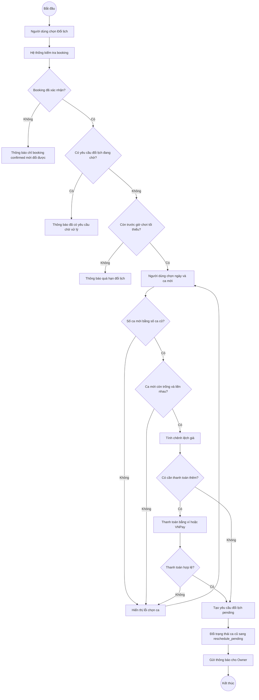
```mermaid
flowchart TD
    A((Bắt đầu)) --> B[Người dùng chọn Đổi lịch]
    B --> C[Hệ thống kiểm tra booking]
    C --> D{Booking đã xác nhận?}
    D -- Không --> E[Thông báo chỉ booking confirmed mới đổi được]
    D -- Có --> F{Có yêu cầu đổi lịch đang chờ?}
    F -- Có --> G[Thông báo đã có yêu cầu chờ xử lý]
    F -- Không --> H{Còn trước giờ chơi tối thiểu?}
    H -- Không --> I[Thông báo quá hạn đổi lịch]
    H -- Có --> J[Người dùng chọn ngày và ca mới]
    J --> K{Số ca mới bằng số ca cũ?}
    K -- Không --> L[Hiển thị lỗi chọn ca]
    L --> J
    K -- Có --> M{Ca mới còn trống và liền nhau?}
    M -- Không --> L
    M -- Có --> N[Tính chênh lệch giá]
    N --> O{Có cần thanh toán thêm?}
    O -- Có --> P[Thanh toán bằng ví hoặc VNPay]
    P --> Q{Thanh toán hợp lệ?}
    Q -- Không --> L
    Q -- Có --> R[Tạo yêu cầu đổi lịch pending]
    O -- Không --> R
    R --> S[Đổi trạng thái ca cũ sang reschedule_pending]
    S --> T[Gửi thông báo cho Owner]
    T --> U((Kết thúc))
```

### 3.7.1.8. Đặt gói sân

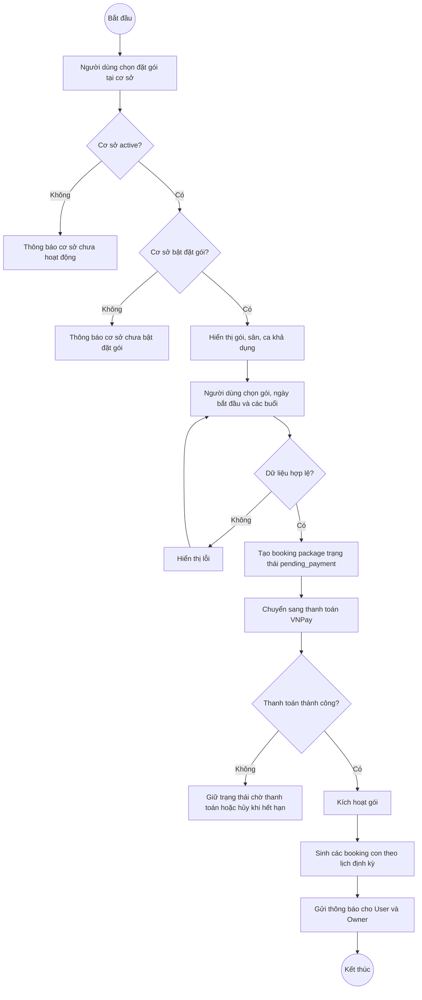
```mermaid
flowchart TD
    A((Bắt đầu)) --> B[Người dùng chọn đặt gói tại cơ sở]
    B --> C{Cơ sở active?}
    C -- Không --> D[Thông báo cơ sở chưa hoạt động]
    C -- Có --> E{Cơ sở bật đặt gói?}
    E -- Không --> F[Thông báo cơ sở chưa bật đặt gói]
    E -- Có --> G[Hiển thị gói, sân, ca khả dụng]
    G --> H[Người dùng chọn gói, ngày bắt đầu và các buổi]
    H --> I{Dữ liệu hợp lệ?}
    I -- Không --> J[Hiển thị lỗi]
    J --> H
    I -- Có --> K[Tạo booking package trạng thái pending_payment]
    K --> L[Chuyển sang thanh toán VNPay]
    L --> M{Thanh toán thành công?}
    M -- Không --> N[Giữ trạng thái chờ thanh toán hoặc hủy khi hết hạn]
    M -- Có --> O[Kích hoạt gói]
    O --> P[Sinh các booking con theo lịch định kỳ]
    P --> Q[Gửi thông báo cho User và Owner]
    Q --> R((Kết thúc))
```

### 3.7.1.9. Quản lý sân yêu thích

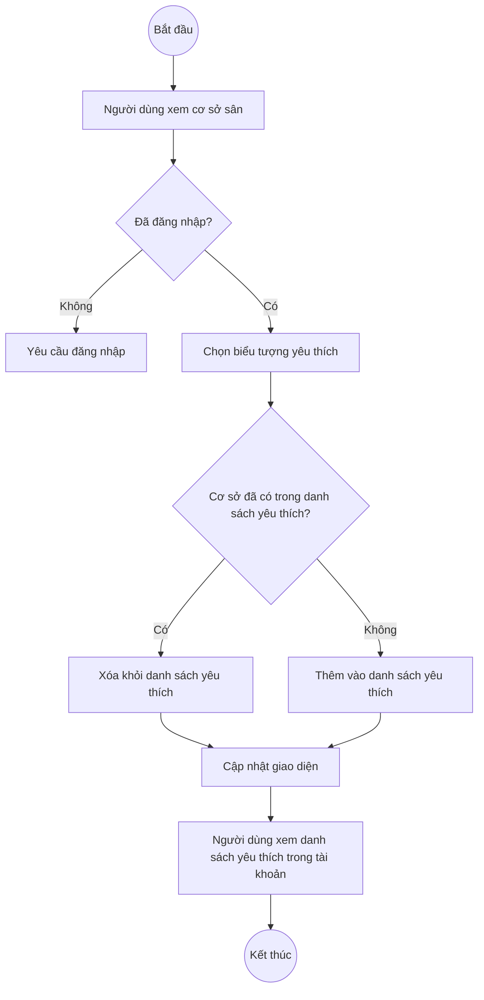
```mermaid
flowchart TD
    A((Bắt đầu)) --> B[Người dùng xem cơ sở sân]
    B --> C{Đã đăng nhập?}
    C -- Không --> D[Yêu cầu đăng nhập]
    C -- Có --> E[Chọn biểu tượng yêu thích]
    E --> F{Cơ sở đã có trong danh sách yêu thích?}
    F -- Có --> G[Xóa khỏi danh sách yêu thích]
    F -- Không --> H[Thêm vào danh sách yêu thích]
    G --> I[Cập nhật giao diện]
    H --> I
    I --> J[Người dùng xem danh sách yêu thích trong tài khoản]
    J --> K((Kết thúc))
```

### 3.7.1.10. Đánh giá và báo cáo sân

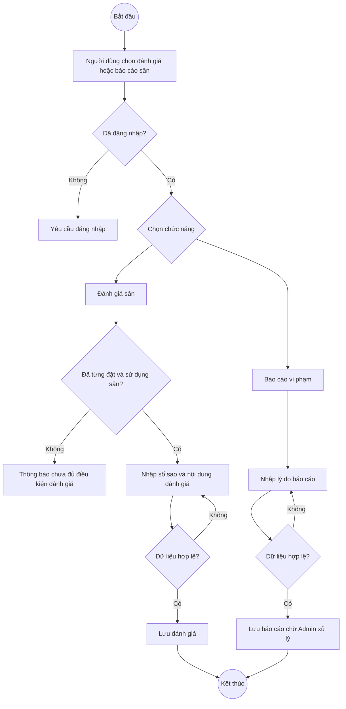
```mermaid
flowchart TD
    A((Bắt đầu)) --> B[Người dùng chọn đánh giá hoặc báo cáo sân]
    B --> C{Đã đăng nhập?}
    C -- Không --> D[Yêu cầu đăng nhập]
    C -- Có --> E{Chọn chức năng}
    E --> F[Đánh giá sân]
    E --> G[Báo cáo vi phạm]
    F --> H{Đã từng đặt và sử dụng sân?}
    H -- Không --> I[Thông báo chưa đủ điều kiện đánh giá]
    H -- Có --> J[Nhập số sao và nội dung đánh giá]
    J --> K{Dữ liệu hợp lệ?}
    K -- Không --> J
    K -- Có --> L[Lưu đánh giá]
    G --> M[Nhập lý do báo cáo]
    M --> N{Dữ liệu hợp lệ?}
    N -- Không --> M
    N -- Có --> O[Lưu báo cáo chờ Admin xử lý]
    L --> P((Kết thúc))
    O --> P
```

### 3.7.1.11. Cộng đồng tìm người chơi

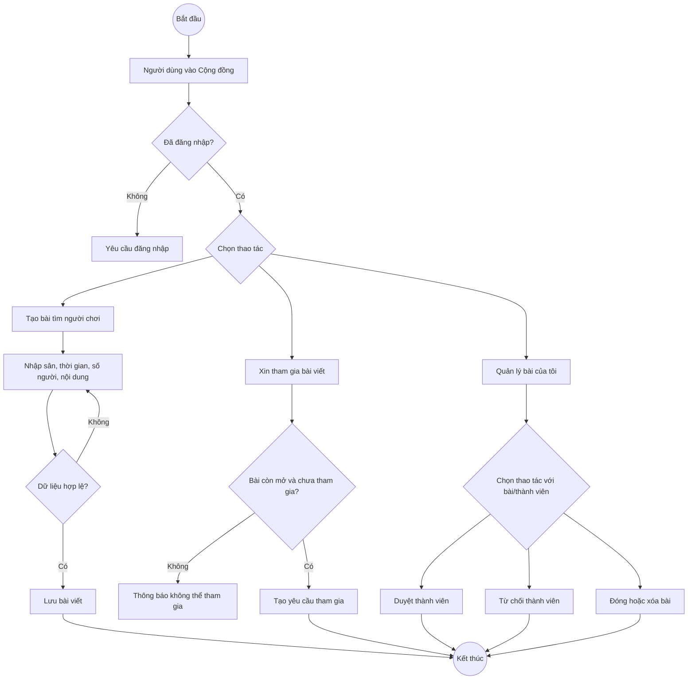
```mermaid
flowchart TD
    A((Bắt đầu)) --> B[Người dùng vào Cộng đồng]
    B --> C{Đã đăng nhập?}
    C -- Không --> D[Yêu cầu đăng nhập]
    C -- Có --> E{Chọn thao tác}
    E --> F[Tạo bài tìm người chơi]
    E --> G[Xin tham gia bài viết]
    E --> H[Quản lý bài của tôi]
    F --> I[Nhập sân, thời gian, số người, nội dung]
    I --> J{Dữ liệu hợp lệ?}
    J -- Không --> I
    J -- Có --> K[Lưu bài viết]
    G --> L{Bài còn mở và chưa tham gia?}
    L -- Không --> M[Thông báo không thể tham gia]
    L -- Có --> N[Tạo yêu cầu tham gia]
    H --> O{Chọn thao tác với bài/thành viên}
    O --> P[Duyệt thành viên]
    O --> Q[Từ chối thành viên]
    O --> R[Đóng hoặc xóa bài]
    K --> S((Kết thúc))
    N --> S
    P --> S
    Q --> S
    R --> S
```

### 3.7.1.12. Quản lý hồ sơ, giao dịch, thông báo và chatbot

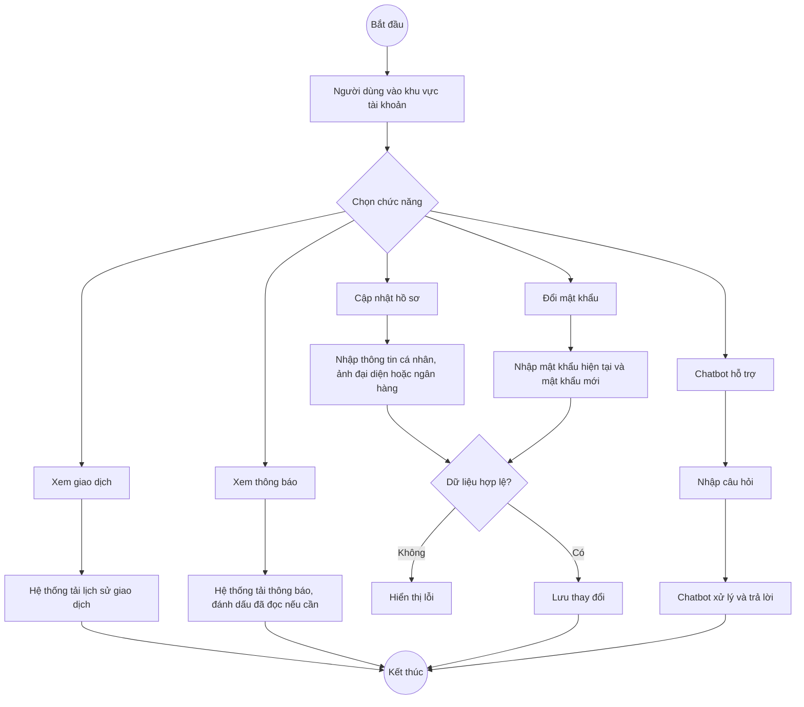
```mermaid
flowchart TD
    A((Bắt đầu)) --> B[Người dùng vào khu vực tài khoản]
    B --> C{Chọn chức năng}
    C --> D[Cập nhật hồ sơ]
    C --> E[Đổi mật khẩu]
    C --> F[Xem giao dịch]
    C --> G[Xem thông báo]
    C --> H[Chatbot hỗ trợ]
    D --> I[Nhập thông tin cá nhân, ảnh đại diện hoặc ngân hàng]
    E --> J[Nhập mật khẩu hiện tại và mật khẩu mới]
    F --> K[Hệ thống tải lịch sử giao dịch]
    G --> L[Hệ thống tải thông báo, đánh dấu đã đọc nếu cần]
    H --> M[Nhập câu hỏi]
    I --> N{Dữ liệu hợp lệ?}
    J --> N
    N -- Không --> O[Hiển thị lỗi]
    N -- Có --> P[Lưu thay đổi]
    M --> Q[Chatbot xử lý và trả lời]
    K --> R((Kết thúc))
    L --> R
    P --> R
    Q --> R
```

## 3.7.2. Chủ sân

### 3.7.2.1. Đăng ký và kích hoạt tài khoản Owner

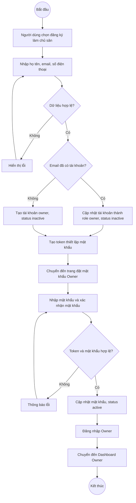
```mermaid
flowchart TD
    A((Bắt đầu)) --> B[Người dùng chọn đăng ký làm chủ sân]
    B --> C[Nhập họ tên, email, số điện thoại]
    C --> D{Dữ liệu hợp lệ?}
    D -- Không --> E[Hiển thị lỗi]
    E --> C
    D -- Có --> F{Email đã có tài khoản?}
    F -- Có --> G[Cập nhật tài khoản thành role owner, status inactive]
    F -- Không --> H[Tạo tài khoản owner, status inactive]
    G --> I[Tạo token thiết lập mật khẩu]
    H --> I
    I --> J[Chuyển đến trang đặt mật khẩu Owner]
    J --> K[Nhập mật khẩu và xác nhận mật khẩu]
    K --> L{Token và mật khẩu hợp lệ?}
    L -- Không --> M[Thông báo lỗi]
    M --> K
    L -- Có --> N[Cập nhật mật khẩu, status active]
    N --> O[Đăng nhập Owner]
    O --> P[Chuyển đến Dashboard Owner]
    P --> Q((Kết thúc))
```

### 3.7.2.2. Quản lý cơ sở sân

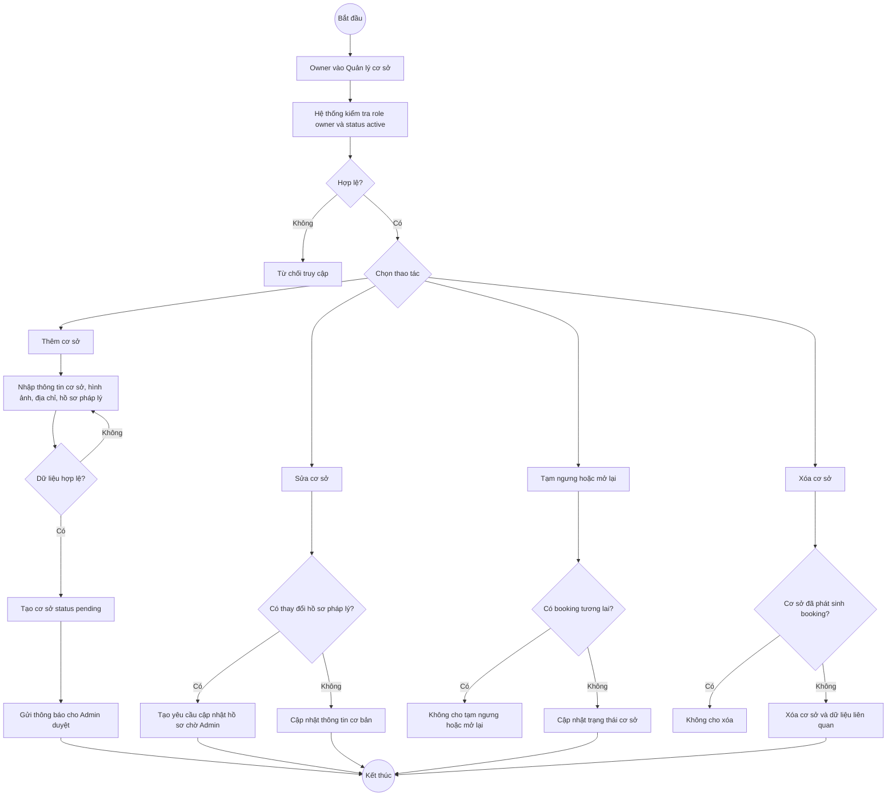
```mermaid
flowchart TD
    A((Bắt đầu)) --> B[Owner vào Quản lý cơ sở]
    B --> C[Hệ thống kiểm tra role owner và status active]
    C --> D{Hợp lệ?}
    D -- Không --> E[Từ chối truy cập]
    D -- Có --> F{Chọn thao tác}
    F --> G[Thêm cơ sở]
    F --> H[Sửa cơ sở]
    F --> I[Tạm ngưng hoặc mở lại]
    F --> J[Xóa cơ sở]
    G --> K[Nhập thông tin cơ sở, hình ảnh, địa chỉ, hồ sơ pháp lý]
    K --> L{Dữ liệu hợp lệ?}
    L -- Không --> K
    L -- Có --> M[Tạo cơ sở status pending]
    M --> N[Gửi thông báo cho Admin duyệt]
    H --> O{Có thay đổi hồ sơ pháp lý?}
    O -- Có --> P[Tạo yêu cầu cập nhật hồ sơ chờ Admin]
    O -- Không --> Q[Cập nhật thông tin cơ bản]
    I --> R{Có booking tương lai?}
    R -- Có --> S[Không cho tạm ngưng hoặc mở lại]
    R -- Không --> T[Cập nhật trạng thái cơ sở]
    J --> U{Cơ sở đã phát sinh booking?}
    U -- Có --> V[Không cho xóa]
    U -- Không --> W[Xóa cơ sở và dữ liệu liên quan]
    N --> X((Kết thúc))
    P --> X
    Q --> X
    T --> X
    W --> X
```

### 3.7.2.3. Quản lý sân con

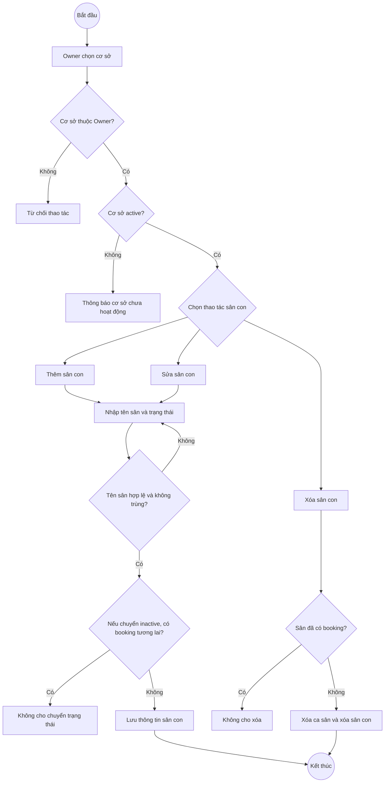
```mermaid
flowchart TD
    A((Bắt đầu)) --> B[Owner chọn cơ sở]
    B --> C{Cơ sở thuộc Owner?}
    C -- Không --> D[Từ chối thao tác]
    C -- Có --> E{Cơ sở active?}
    E -- Không --> F[Thông báo cơ sở chưa hoạt động]
    E -- Có --> G{Chọn thao tác sân con}
    G --> H[Thêm sân con]
    G --> I[Sửa sân con]
    G --> J[Xóa sân con]
    H --> K[Nhập tên sân và trạng thái]
    I --> K
    K --> L{Tên sân hợp lệ và không trùng?}
    L -- Không --> K
    L -- Có --> M{Nếu chuyển inactive, có booking tương lai?}
    M -- Có --> N[Không cho chuyển trạng thái]
    M -- Không --> O[Lưu thông tin sân con]
    J --> P{Sân đã có booking?}
    P -- Có --> Q[Không cho xóa]
    P -- Không --> R[Xóa ca sân và xóa sân con]
    O --> S((Kết thúc))
    R --> S
```

### 3.7.2.4. Quản lý ca sân, giá vé và khóa bảo trì

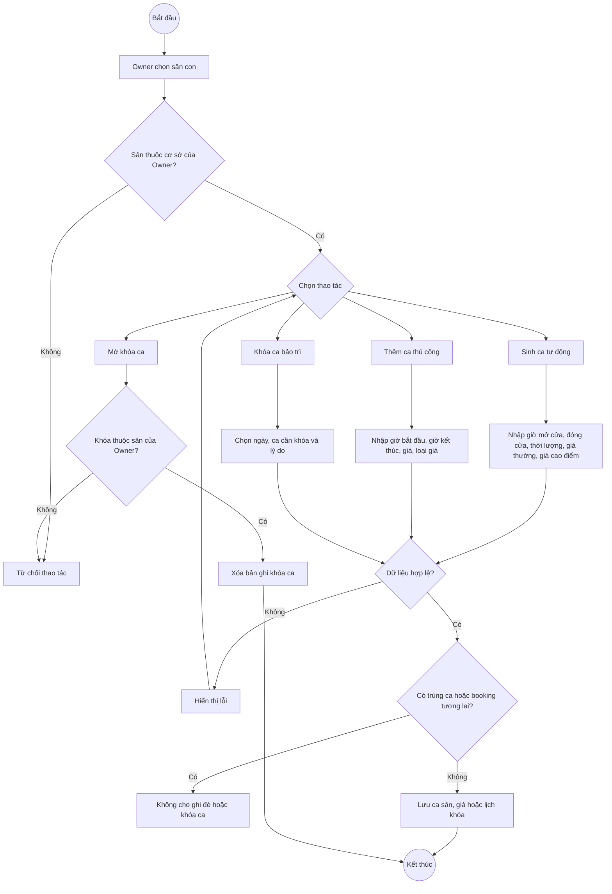
```mermaid
flowchart TD
    A((Bắt đầu)) --> B[Owner chọn sân con]
    B --> C{Sân thuộc cơ sở của Owner?}
    C -- Không --> D[Từ chối thao tác]
    C -- Có --> E{Chọn thao tác}
    E --> F[Sinh ca tự động]
    E --> G[Thêm ca thủ công]
    E --> H[Khóa ca bảo trì]
    E --> I[Mở khóa ca]
    F --> J[Nhập giờ mở cửa, đóng cửa, thời lượng, giá thường, giá cao điểm]
    G --> K[Nhập giờ bắt đầu, giờ kết thúc, giá, loại giá]
    H --> L[Chọn ngày, ca cần khóa và lý do]
    J --> M{Dữ liệu hợp lệ?}
    K --> M
    L --> M
    M -- Không --> N[Hiển thị lỗi]
    N --> E
    M -- Có --> O{Có trùng ca hoặc booking tương lai?}
    O -- Có --> P[Không cho ghi đè hoặc khóa ca]
    O -- Không --> Q[Lưu ca sân, giá hoặc lịch khóa]
    I --> R{Khóa thuộc sân của Owner?}
    R -- Không --> D
    R -- Có --> S[Xóa bản ghi khóa ca]
    Q --> T((Kết thúc))
    S --> T
```

### 3.7.2.5. Quản lý lịch đặt sân

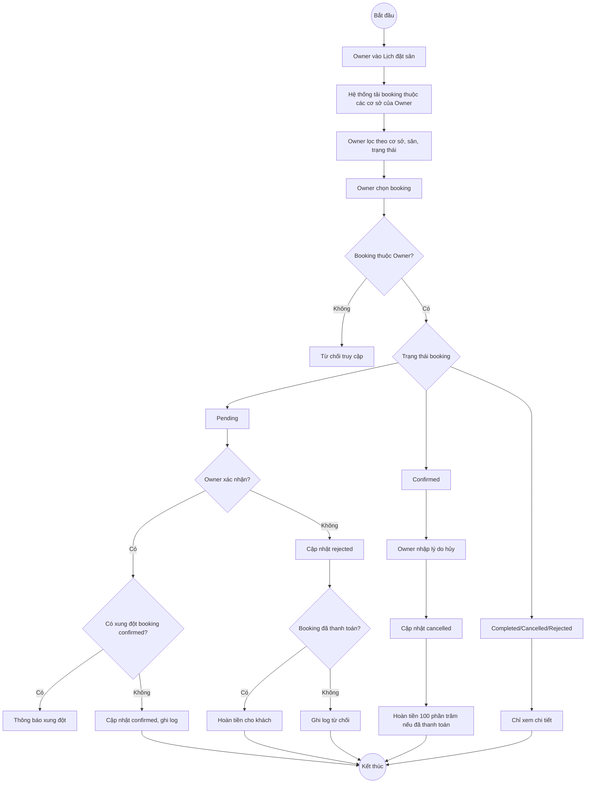
```mermaid
flowchart TD
    A((Bắt đầu)) --> B[Owner vào Lịch đặt sân]
    B --> C[Hệ thống tải booking thuộc các cơ sở của Owner]
    C --> D[Owner lọc theo cơ sở, sân, trạng thái]
    D --> E[Owner chọn booking]
    E --> F{Booking thuộc Owner?}
    F -- Không --> G[Từ chối truy cập]
    F -- Có --> H{Trạng thái booking}
    H --> I[Pending]
    H --> J[Confirmed]
    H --> K[Completed/Cancelled/Rejected]
    I --> L{Owner xác nhận?}
    L -- Có --> M{Có xung đột booking confirmed?}
    M -- Có --> N[Thông báo xung đột]
    M -- Không --> O[Cập nhật confirmed, ghi log]
    L -- Không --> P[Cập nhật rejected]
    P --> Q{Booking đã thanh toán?}
    Q -- Có --> R[Hoàn tiền cho khách]
    Q -- Không --> S[Ghi log từ chối]
    J --> T[Owner nhập lý do hủy]
    T --> U[Cập nhật cancelled]
    U --> V[Hoàn tiền 100 phần trăm nếu đã thanh toán]
    K --> W[Chỉ xem chi tiết]
    O --> X((Kết thúc))
    R --> X
    S --> X
    V --> X
    W --> X
```

### 3.7.2.6. Xử lý yêu cầu đổi lịch

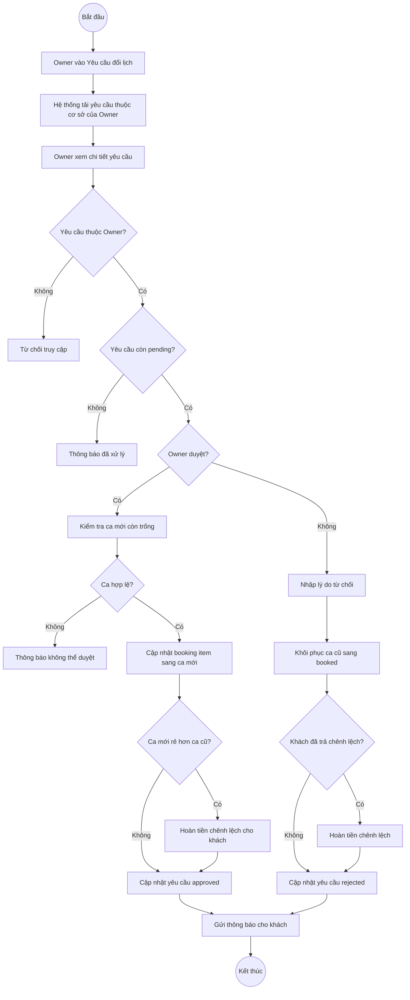
```mermaid
flowchart TD
    A((Bắt đầu)) --> B[Owner vào Yêu cầu đổi lịch]
    B --> C[Hệ thống tải yêu cầu thuộc cơ sở của Owner]
    C --> D[Owner xem chi tiết yêu cầu]
    D --> E{Yêu cầu thuộc Owner?}
    E -- Không --> F[Từ chối truy cập]
    E -- Có --> G{Yêu cầu còn pending?}
    G -- Không --> H[Thông báo đã xử lý]
    G -- Có --> I{Owner duyệt?}
    I -- Có --> J[Kiểm tra ca mới còn trống]
    J --> K{Ca hợp lệ?}
    K -- Không --> L[Thông báo không thể duyệt]
    K -- Có --> M[Cập nhật booking item sang ca mới]
    M --> N{Ca mới rẻ hơn ca cũ?}
    N -- Có --> O[Hoàn tiền chênh lệch cho khách]
    N -- Không --> P[Cập nhật yêu cầu approved]
    O --> P
    I -- Không --> Q[Nhập lý do từ chối]
    Q --> R[Khôi phục ca cũ sang booked]
    R --> S{Khách đã trả chênh lệch?}
    S -- Có --> T[Hoàn tiền chênh lệch]
    S -- Không --> U[Cập nhật yêu cầu rejected]
    T --> U
    P --> V[Gửi thông báo cho khách]
    U --> V
    V --> W((Kết thúc))
```

### 3.7.2.7. Quản lý gói đặt sân

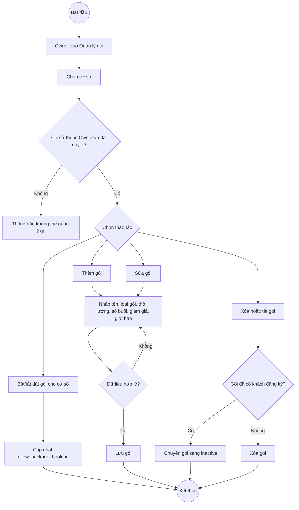
```mermaid
flowchart TD
    A((Bắt đầu)) --> B[Owner vào Quản lý gói]
    B --> C[Chọn cơ sở]
    C --> D{Cơ sở thuộc Owner và đã duyệt?}
    D -- Không --> E[Thông báo không thể quản lý gói]
    D -- Có --> F{Chọn thao tác}
    F --> G[Bật/tắt đặt gói cho cơ sở]
    F --> H[Thêm gói]
    F --> I[Sửa gói]
    F --> J[Xóa hoặc tắt gói]
    G --> K[Cập nhật allow_package_booking]
    H --> L[Nhập tên, loại gói, thời lượng, số buổi, giảm giá, giới hạn]
    I --> L
    L --> M{Dữ liệu hợp lệ?}
    M -- Không --> L
    M -- Có --> N[Lưu gói]
    J --> O{Gói đã có khách đăng ký?}
    O -- Có --> P[Chuyển gói sang inactive]
    O -- Không --> Q[Xóa gói]
    K --> R((Kết thúc))
    N --> R
    P --> R
    Q --> R
```

### 3.7.2.8. Quản lý dịch vụ đi kèm

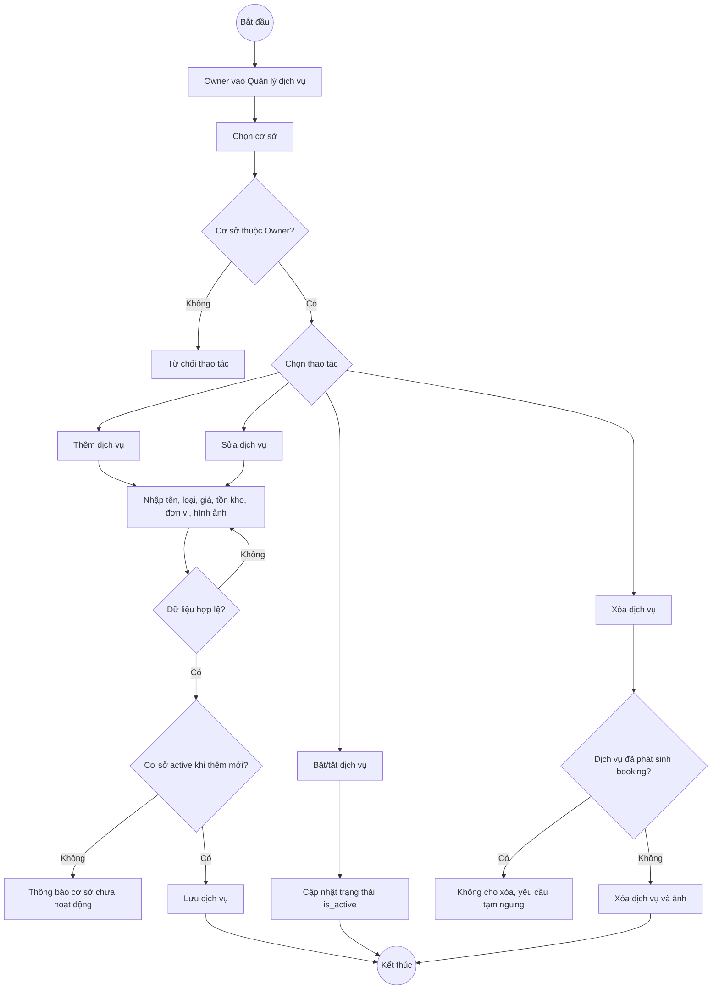
```mermaid
flowchart TD
    A((Bắt đầu)) --> B[Owner vào Quản lý dịch vụ]
    B --> C[Chọn cơ sở]
    C --> D{Cơ sở thuộc Owner?}
    D -- Không --> E[Từ chối thao tác]
    D -- Có --> F{Chọn thao tác}
    F --> G[Thêm dịch vụ]
    F --> H[Sửa dịch vụ]
    F --> I[Bật/tắt dịch vụ]
    F --> J[Xóa dịch vụ]
    G --> K[Nhập tên, loại, giá, tồn kho, đơn vị, hình ảnh]
    H --> K
    K --> L{Dữ liệu hợp lệ?}
    L -- Không --> K
    L -- Có --> M{Cơ sở active khi thêm mới?}
    M -- Không --> N[Thông báo cơ sở chưa hoạt động]
    M -- Có --> O[Lưu dịch vụ]
    I --> P[Cập nhật trạng thái is_active]
    J --> Q{Dịch vụ đã phát sinh booking?}
    Q -- Có --> R[Không cho xóa, yêu cầu tạm ngưng]
    Q -- Không --> S[Xóa dịch vụ và ảnh]
    O --> T((Kết thúc))
    P --> T
    S --> T
```

### 3.7.2.9. Quản lý voucher

```mermaid
flowchart TD
    A((Bắt đầu)) --> B[Owner vào Quản lý voucher]
    B --> C{Chọn thao tác}
    C --> D[Tạo voucher]
    C --> E[Sửa voucher]
    C --> F[Gia hạn hoặc tăng lượt dùng]
    C --> G[Bật/tắt voucher]
    C --> H[Xóa voucher]
    C --> I[Xem báo cáo voucher]
    D --> J[Nhập tên, mã, loại giảm, giá trị, thời gian, cơ sở áp dụng]
    E --> J
    F --> K[Nhập ngày gia hạn hoặc số lượt bổ sung]
    J --> L{Dữ liệu hợp lệ và cơ sở thuộc Owner?}
    K --> L
    L -- Không --> M[Hiển thị lỗi]
    M --> C
    L -- Có --> N[Lưu voucher]
    G --> O[Cập nhật trạng thái active/disabled]
    H --> P{Voucher có thể xóa?}
    P -- Không --> Q[Thông báo không thể xóa]
    P -- Có --> R[Xóa voucher]
    I --> S[Tổng hợp lượt dùng, doanh thu, hiệu quả]
    N --> T((Kết thúc))
    O --> T
    R --> T
    S --> T
```

### 3.7.2.10. Quản lý đánh giá

```mermaid
flowchart TD
    A((Bắt đầu)) --> B[Owner vào Quản lý đánh giá]
    B --> C[Hệ thống tải đánh giá thuộc cơ sở của Owner]
    C --> D[Owner chọn đánh giá]
    D --> E{Đánh giá thuộc cơ sở của Owner?}
    E -- Không --> F[Từ chối truy cập]
    E -- Có --> G[Owner nhập phản hồi]
    G --> H{Nội dung hợp lệ?}
    H -- Không --> G
    H -- Có --> I[Lưu phản hồi của Owner]
    I --> J[Hiển thị phản hồi cho khách hàng]
    J --> K((Kết thúc))
```

### 3.7.2.11. Quản lý ví và yêu cầu rút tiền

```mermaid
flowchart TD
    A((Bắt đầu)) --> B[Owner vào Ví]
    B --> C[Hệ thống hiển thị số dư và giao dịch]
    C --> D{Chọn thao tác}
    D --> E[Nạp tiền]
    D --> F[Cập nhật ngân hàng]
    D --> G[Tạo yêu cầu rút tiền]
    E --> H[Nhập số tiền nạp]
    H --> I[Chuyển sang VNPay]
    I --> J{Thanh toán thành công?}
    J -- Không --> K[Thông báo thất bại]
    J -- Có --> L[Cộng tiền vào ví]
    F --> M[Nhập ngân hàng, số tài khoản, chủ tài khoản]
    M --> N{Thông tin hợp lệ?}
    N -- Không --> M
    N -- Có --> O[Lưu thông tin ngân hàng]
    G --> P[Nhập số tiền rút và ghi chú]
    P --> Q{Số dư đủ và ngân hàng hợp lệ?}
    Q -- Không --> R[Hiển thị lỗi]
    Q -- Có --> S[Tạo yêu cầu rút tiền pending]
    S --> T[Chờ Admin duyệt]
    L --> U((Kết thúc))
    O --> U
    T --> U
```

### 3.7.2.12. Quản lý hợp đồng hợp tác

```mermaid
flowchart TD
    A((Bắt đầu)) --> B[Owner vào Hợp đồng]
    B --> C[Hệ thống tải hợp đồng của Owner]
    C --> D[Owner xem chi tiết hợp đồng]
    D --> E{Hợp đồng thuộc Owner?}
    E -- Không --> F[Từ chối truy cập]
    E -- Có --> G{Trạng thái hợp đồng sent?}
    G -- Không --> H[Chỉ xem hoặc tải PDF]
    G -- Có --> I{Owner chọn thao tác}
    I --> J[Ký hợp đồng]
    I --> K[Từ chối hợp đồng]
    J --> L{Hợp đồng còn hiệu lực?}
    L -- Không --> M[Thông báo hợp đồng quá hạn]
    L -- Có --> N[Cập nhật hợp đồng accepted]
    N --> O{Ngày hiệu lực đã đến?}
    O -- Có --> P[Kích hoạt cơ sở active và áp dụng hoa hồng]
    O -- Không --> Q[Cơ sở chờ đến ngày hiệu lực]
    K --> R[Nhập lý do từ chối]
    R --> S[Cập nhật hợp đồng rejected]
    H --> T((Kết thúc))
    P --> T
    Q --> T
    S --> T
```

### 3.7.2.13. Chuyển nhượng cơ sở

```mermaid
flowchart TD
    A((Bắt đầu)) --> B[Owner chọn Chuyển nhượng cơ sở]
    B --> C{Có cơ sở active thuộc Owner?}
    C -- Không --> D[Thông báo không có cơ sở đủ điều kiện]
    C -- Có --> E[Chọn cơ sở và nhập email Owner nhận]
    E --> F{Email Owner nhận hợp lệ?}
    F -- Không --> G[Thông báo không tìm thấy Owner]
    G --> E
    F -- Có --> H[Nhập thông tin hợp đồng chuyển nhượng]
    H --> I[Tạo hợp đồng nháp draft]
    I --> J[Owner gửi hợp đồng cho bên nhận]
    J --> K[Bên nhận điền hồ sơ pháp lý]
    K --> L{Hồ sơ hợp lệ?}
    L -- Không --> K
    L -- Có --> M[Bên nhận ký hợp đồng điện tử]
    M --> N[Cập nhật trạng thái signed]
    N --> O[Gửi thông báo cho Admin duyệt]
    O --> P((Kết thúc))
```

## 3.7.3. Quản trị viên

### 3.7.3.1. Đăng nhập Admin

```mermaid
flowchart TD
    A((Bắt đầu)) --> B[Admin truy cập /admin/login]
    B --> C[Nhập email và mật khẩu]
    C --> D{Thông tin đăng nhập đúng?}
    D -- Không --> E[Hiển thị lỗi đăng nhập]
    E --> C
    D -- Có --> F{Role là admin?}
    F -- Không --> G[Từ chối truy cập]
    F -- Có --> H{Status active?}
    H -- Không --> I[Thông báo tài khoản chưa kích hoạt]
    H -- Có --> J[Tạo phiên đăng nhập Admin]
    J --> K[Chuyển đến Dashboard Admin]
    K --> L((Kết thúc))
```

### 3.7.3.2. Quản lý người dùng

```mermaid
flowchart TD
    A((Bắt đầu)) --> B[Admin vào Quản lý người dùng]
    B --> C[Hệ thống hiển thị danh sách user]
    C --> D[Admin tìm kiếm hoặc lọc theo vai trò]
    D --> E{Chọn thao tác}
    E --> F[Thêm người dùng]
    E --> G[Sửa người dùng]
    E --> H[Xem chi tiết]
    F --> I[Nhập tên, email, mật khẩu, vai trò, trạng thái]
    G --> J[Chỉnh sửa tên, email, mật khẩu, vai trò, trạng thái]
    I --> K{Dữ liệu hợp lệ?}
    J --> K
    K -- Không --> L[Hiển thị lỗi]
    L --> E
    K -- Có --> M{Email bị trùng?}
    M -- Có --> L
    M -- Không --> N[Lưu thông tin người dùng]
    H --> O[Hiển thị chi tiết tài khoản]
    N --> P((Kết thúc))
    O --> P
```

### 3.7.3.3. Quản lý cơ sở và duyệt hồ sơ

```mermaid
flowchart TD
    A((Bắt đầu)) --> B[Admin vào Quản lý cơ sở]
    B --> C[Hệ thống tải danh sách cơ sở]
    C --> D[Admin lọc theo trạng thái, môn thể thao, từ khóa]
    D --> E[Admin chọn cơ sở]
    E --> F{Chọn thao tác}
    F --> G[Duyệt cơ sở]
    F --> H[Từ chối cơ sở]
    F --> I[Cập nhật trạng thái/thông tin]
    F --> J[Xóa cơ sở]
    G --> K{Cơ sở đang pending?}
    K -- Không --> L[Thông báo chỉ duyệt cơ sở pending]
    K -- Có --> M[Cập nhật cơ sở và hồ sơ pháp lý approved]
    M --> N[Gửi thông báo cho Owner]
    H --> O{Cơ sở đang pending?}
    O -- Không --> L
    O -- Có --> P[Admin nhập lý do từ chối]
    P --> Q[Cập nhật rejected]
    Q --> N
    I --> R[Nhập thông tin cần cập nhật]
    R --> S{Dữ liệu hợp lệ?}
    S -- Không --> R
    S -- Có --> T[Lưu cập nhật]
    J --> U{Có booking tương lai?}
    U -- Có --> V[Không cho xóa]
    U -- Không --> W[Xóa cơ sở]
    N --> X((Kết thúc))
    T --> X
    W --> X
```

### 3.7.3.4. Duyệt yêu cầu cập nhật hồ sơ pháp lý

```mermaid
flowchart TD
    A((Bắt đầu)) --> B[Admin mở yêu cầu cập nhật hồ sơ]
    B --> C[Hệ thống hiển thị dữ liệu Owner đề xuất]
    C --> D{Yêu cầu còn pending?}
    D -- Không --> E[Thông báo yêu cầu đã xử lý]
    D -- Có --> F{Admin duyệt?}
    F -- Có --> G[Cập nhật thông tin cơ sở]
    G --> H[Cập nhật hoặc tạo hồ sơ pháp lý]
    H --> I[Cập nhật yêu cầu approved]
    I --> J[Gửi thông báo duyệt cho Owner]
    F -- Không --> K[Admin nhập lý do từ chối]
    K --> L{Lý do hợp lệ?}
    L -- Không --> K
    L -- Có --> M[Cập nhật yêu cầu rejected]
    M --> N[Gửi thông báo từ chối cho Owner]
    J --> O((Kết thúc))
    N --> O
```

### 3.7.3.5. Quản lý sân con

```mermaid
flowchart TD
    A((Bắt đầu)) --> B[Admin vào Quản lý sân]
    B --> C[Hệ thống tải danh sách sân con toàn hệ thống]
    C --> D[Admin lọc theo cơ sở, Owner, trạng thái]
    D --> E[Admin chọn sân]
    E --> F{Chọn thao tác}
    F --> G[Xem chi tiết]
    F --> H[Bật/tắt trạng thái]
    F --> I[Sửa thông tin]
    F --> J[Xóa sân]
    F --> K[Cập nhật trạng thái hàng loạt]
    H --> L{Sân có booking tương lai?}
    L -- Có --> M[Không cho tắt nếu ảnh hưởng lịch]
    L -- Không --> N[Cập nhật trạng thái sân]
    I --> O[Nhập thông tin sửa]
    O --> P{Dữ liệu hợp lệ?}
    P -- Không --> O
    P -- Có --> Q[Lưu cập nhật]
    J --> R{Sân có dữ liệu booking?}
    R -- Có --> S[Không cho xóa]
    R -- Không --> T[Xóa sân]
    G --> U((Kết thúc))
    N --> U
    Q --> U
    T --> U
    K --> U
```

### 3.7.3.6. Quản lý lịch đặt và hoàn tiền

```mermaid
flowchart TD
    A((Bắt đầu)) --> B[Admin vào Quản lý đặt sân]
    B --> C[Hệ thống tải danh sách booking]
    C --> D[Admin tìm kiếm hoặc lọc booking]
    D --> E[Admin chọn booking]
    E --> F{Chọn thao tác}
    F --> G[Xem chi tiết]
    F --> H[Hoàn tiền]
    H --> I{Booking đủ điều kiện hoàn tiền?}
    I -- Không --> J[Thông báo không thể hoàn tiền]
    I -- Có --> K[Nhập thông tin hoàn tiền]
    K --> L[Cập nhật refund_amount và refund_status]
    L --> M[Ghi nhận giao dịch hoàn tiền nếu có]
    M --> N[Gửi thông báo cho người dùng]
    G --> O((Kết thúc))
    N --> O
```

### 3.7.3.7. Quản lý báo cáo vi phạm

```mermaid
flowchart TD
    A((Bắt đầu)) --> B[Admin vào Báo cáo vi phạm]
    B --> C[Hệ thống tải danh sách báo cáo]
    C --> D[Admin chọn một báo cáo]
    D --> E[Admin xem nội dung báo cáo và thông tin sân]
    E --> F{Chọn trạng thái xử lý}
    F --> G[Đang xử lý]
    F --> H[Đã xử lý]
    F --> I[Từ chối báo cáo]
    G --> J[Cập nhật trạng thái báo cáo]
    H --> J
    I --> J
    J --> K[Hiển thị thông báo thành công]
    K --> L((Kết thúc))
```

### 3.7.3.8. Quản lý giao dịch

```mermaid
flowchart TD
    A((Bắt đầu)) --> B[Admin vào Lịch sử giao dịch]
    B --> C[Hệ thống tải giao dịch booking, gói, ví]
    C --> D[Admin lọc theo từ khóa, trạng thái, thời gian]
    D --> E{Có giao dịch phù hợp?}
    E -- Không --> F[Hiển thị danh sách rỗng]
    E -- Có --> G[Hiển thị danh sách giao dịch]
    G --> H[Admin chọn một giao dịch]
    H --> I[Hiển thị chi tiết giao dịch, người dùng, booking liên quan]
    I --> J((Kết thúc))
```

### 3.7.3.9. Quản lý tài chính và rút doanh thu nền tảng

```mermaid
flowchart TD
    A((Bắt đầu)) --> B[Admin vào Tổng quan tài chính]
    B --> C[Hệ thống tổng hợp doanh thu, hoa hồng, ví nền tảng]
    C --> D[Admin lọc theo Owner hoặc thời gian]
    D --> E[Hiển thị biểu đồ và bảng dữ liệu]
    E --> F{Admin rút doanh thu nền tảng?}
    F -- Không --> G((Kết thúc))
    F -- Có --> H[Nhập số tiền rút]
    H --> I{Số tiền hợp lệ và ví đủ?}
    I -- Không --> J[Hiển thị lỗi]
    J --> H
    I -- Có --> K[Trừ ví nền tảng]
    K --> L[Ghi giao dịch rút doanh thu]
    L --> M[Hiển thị lịch sử rút]
    M --> G
```

### 3.7.3.10. Quản lý yêu cầu rút tiền của Owner

```mermaid
flowchart TD
    A((Bắt đầu)) --> B[Admin vào Yêu cầu rút tiền]
    B --> C[Hệ thống tải danh sách withdrawal]
    C --> D[Admin lọc theo trạng thái hoặc Owner]
    D --> E[Admin chọn yêu cầu]
    E --> F{Yêu cầu còn pending?}
    F -- Không --> G[Thông báo yêu cầu đã xử lý]
    F -- Có --> H{Admin duyệt?}
    H -- Có --> I[Tải ảnh minh chứng chuyển khoản]
    I --> J{Minh chứng hợp lệ?}
    J -- Không --> I
    J -- Có --> K[Trừ ví Owner]
    K --> L[Cập nhật yêu cầu approved]
    L --> M[Gửi thông báo cho Owner]
    H -- Không --> N[Nhập ghi chú từ chối]
    N --> O[Cập nhật yêu cầu rejected]
    O --> M
    M --> P((Kết thúc))
```

### 3.7.3.11. Quản lý hợp đồng

```mermaid
flowchart TD
    A((Bắt đầu)) --> B[Admin vào Quản lý hợp đồng]
    B --> C[Hệ thống tải danh sách hợp đồng]
    C --> D{Chọn thao tác}
    D --> E[Tạo hợp đồng]
    D --> F[Sửa hợp đồng]
    D --> G[Gửi hợp đồng]
    D --> H[Xuất PDF]
    D --> I[Chấm dứt hợp đồng]
    E --> J[Chọn Owner, cơ sở, thời hạn, hoa hồng, nội dung]
    F --> J
    J --> K{Dữ liệu hợp lệ và cơ sở thuộc Owner?}
    K -- Không --> J
    K -- Có --> L[Lưu hợp đồng draft]
    G --> M{Hợp đồng draft hoặc rejected?}
    M -- Không --> N[Thông báo không thể gửi]
    M -- Có --> O[Cập nhật sent và gửi cho Owner]
    H --> P[Tạo hoặc tải file PDF]
    I --> Q{Hợp đồng accepted?}
    Q -- Không --> R[Thông báo không thể chấm dứt]
    Q -- Có --> S{Cơ sở có booking tương lai?}
    S -- Có --> T[Không cho chấm dứt]
    S -- Không --> U[Cập nhật hợp đồng terminated]
    U --> V[Cập nhật cơ sở inactive]
    L --> W((Kết thúc))
    O --> W
    P --> W
    V --> W
```

### 3.7.3.12. Quản lý chuyển nhượng cơ sở

```mermaid
flowchart TD
    A((Bắt đầu)) --> B[Admin vào Chuyển nhượng cơ sở]
    B --> C[Hệ thống tải danh sách yêu cầu chuyển nhượng]
    C --> D[Admin chọn yêu cầu]
    D --> E{Yêu cầu ở trạng thái signed hoặc pending_admin?}
    E -- Không --> F[Thông báo chưa đủ điều kiện duyệt]
    E -- Có --> G[Admin xem hợp đồng, chủ cũ, chủ mới, hồ sơ]
    G --> H{Admin duyệt?}
    H -- Không --> I[Nhập lý do từ chối]
    I --> J[Cập nhật yêu cầu rejected]
    J --> K[Gửi thông báo cho Owner]
    H -- Có --> L[Chuyển owner_id của cơ sở sang Owner mới]
    L --> M[Chấm dứt hợp đồng cũ của cơ sở]
    M --> N[Tạo hoặc cập nhật hồ sơ pháp lý chủ mới]
    N --> O[Cập nhật cơ sở status approved]
    O --> P[Cập nhật yêu cầu approved]
    P --> Q[Gợi ý Admin tạo hợp đồng mới cho Owner mới]
    Q --> K
    K --> R((Kết thúc))
```

### 3.7.3.13. Cài đặt hệ thống, tài chính, gói và chatbot

```mermaid
flowchart TD
    A((Bắt đầu)) --> B[Admin chọn nhóm cấu hình]
    B --> C{Chọn chức năng}
    C --> D[Cài đặt hệ thống]
    C --> E[Cấu hình tài chính]
    C --> F[Quản lý gói toàn hệ thống]
    C --> G[Xem chatbot logs]
    D --> H[Nhập giá trị cấu hình]
    E --> I[Nhập hoa hồng, phí, quy định tài chính]
    F --> J[Xem danh sách gói và trạng thái]
    G --> K[Xem hội thoại và tin nhắn chatbot]
    H --> L{Dữ liệu hợp lệ?}
    I --> L
    L -- Không --> M[Hiển thị lỗi]
    M --> B
    L -- Có --> N[Lưu cấu hình]
    J --> O[Hiển thị dữ liệu gói]
    K --> P[Hiển thị lịch sử chatbot]
    N --> Q((Kết thúc))
    O --> Q
    P --> Q
```

## Gợi ý đưa vào Word

- Mỗi mục `3.7.x.x` tương ứng một sơ đồ hoạt động riêng.
- Khi vẽ lại bằng Draw.io, Visio hoặc Word Shapes:
  - Hình tròn: bắt đầu/kết thúc.
  - Hình chữ nhật: bước xử lý.
  - Hình thoi: điều kiện kiểm tra.
  - Nhánh đúng/sai ghi `Có/Không` hoặc `True/False`.
- Nếu báo cáo cần ngắn hơn, có thể giữ các sơ đồ nghiệp vụ chính: đặt sân, hủy sân, đổi lịch, quản lý cơ sở, quản lý booking, quản lý hợp đồng, quản lý rút tiền và quản lý chuyển nhượng.
